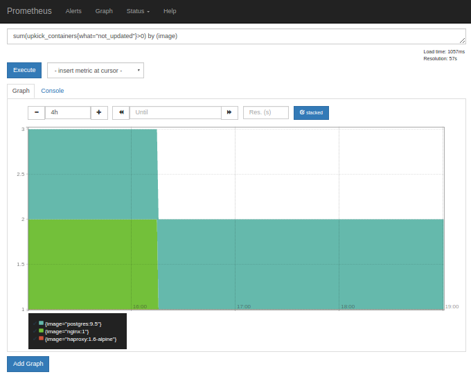
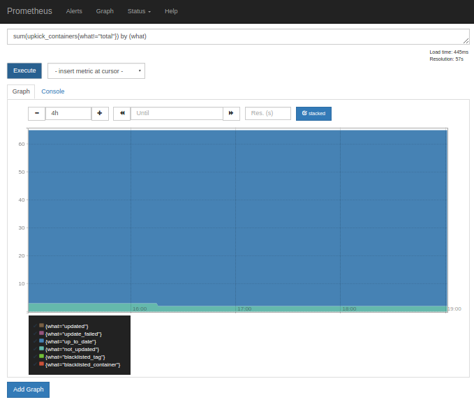
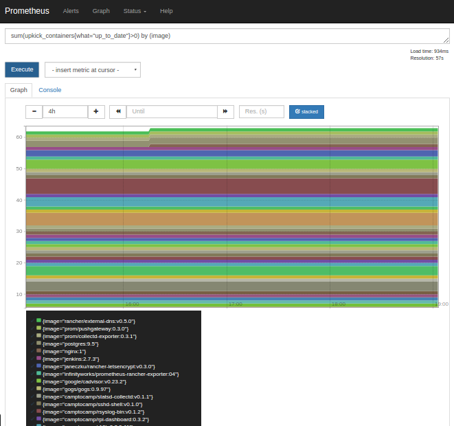

Upkick
======

[](https://hub.docker.com/r/camptocamp/upkick/)
[](https://travis-ci.org/camptocamp/upkick)
[](https://coveralls.io/r/camptocamp/upkick?branch=master)
[](https://goreportcard.com/report/github.com/camptocamp/upkick)
[](http://www.camptocamp.com)


Unattended upgrades for Docker containers, the hard way.


## Installing

```shell
$ go get github.com/camptocamp/upkick
```

## What does it do?

Upkick helps you keep your containers up-to-date. When you launch it, it performs the following actions:

1) list all running containers on the Docker socket
2) update (pull) all images used in the containers
3) unless `--warn-only` is used, stop/remove all containers using outdated images (you need an orchestrator such as Rancher to restart them)
4) if a Prometheus gateway is provided, push metrics to it


## Isn't that what catalog templates are for?

No. Catalog templates usually use tagged versions of images. However, Docker tags are not fixed: they correspond more to branches actually. So while a new catalog template might upgrade the tag and force an upgrade of a container, there is never a garantee that the container runs on the latest hash for the given tag. This is a concern for security, as images should be rebuilt on a regular basis.

Rancher allows to set containers to "Always pull image before creating". While this is useful, it only garantees that images are updated when containers are recreated. We want containers to be up-to-date all the time!


## Usage

```shell
Usage:
  upkick [OPTIONS]

Application Options:
  -V, --version          Display version.
  -l, --loglevel=        Set loglevel ('debug', 'info', 'warn', 'error', 'fatal', 'panic'). (default: info) [$UPKICK_LOG_LEVEL]
  -m, --manpage          Output manpage.
  -j, --json             Log as JSON (to stderr). [$UPKICK_JSON_OUTPUT]
  -w, --warn-only        Only warn, do not kick out-of-date containers. [$UPKICK_WARN_ONLY]

Docker Options:
  -e, --docker-endpoint= The Docker endpoint. (default: unix:///var/run/docker.sock) [$DOCKER_ENDPOINT]

Help Options:
  -h, --help             Show this help message
```

## Using Docker

```shell
$ docker run -v /var/run/docker.sock:/var/run/docker.sock:ro  --rm -ti \
     camptocamp/upkick
```

## Per container opt-out

You can set containers to only warn if they are outdated by placing an `io.upkick.warn_only=true` label on them.


## Metrics

Upkick can push metrics to a Prometheus gateway. The currently exported metrics are:

* `upkick_containers{what="total",image="<image>"}`: total number of containers using a given image tag
* `upkick_containers{what="blacklisted_tag",image="<image>"}`: number of containers using a given image that is blacklisted
* `upkick_containers{what="blacklisted_container",image="<image>"}`: number of containers that opted-out of update (using labels)
* `upkick_containers{what="up_to_date",image="<image>"}`: number of containers using a given image already up-to-date
* `upkick_containers{what="updated",image="<image>"}`: number of containers using a given image successfully updated 
* `upkick_containers{what="update_failed",image="<image>"}`: number of containers using a given image whose update failed
* `upkick_containers{what="not_updated",image="<image>"}`: number of containers using a given image that were not updated (because `--warn-only` was used)


Here are some examples of useful Prometheus queries using these metrics:





